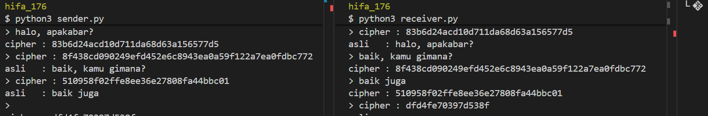
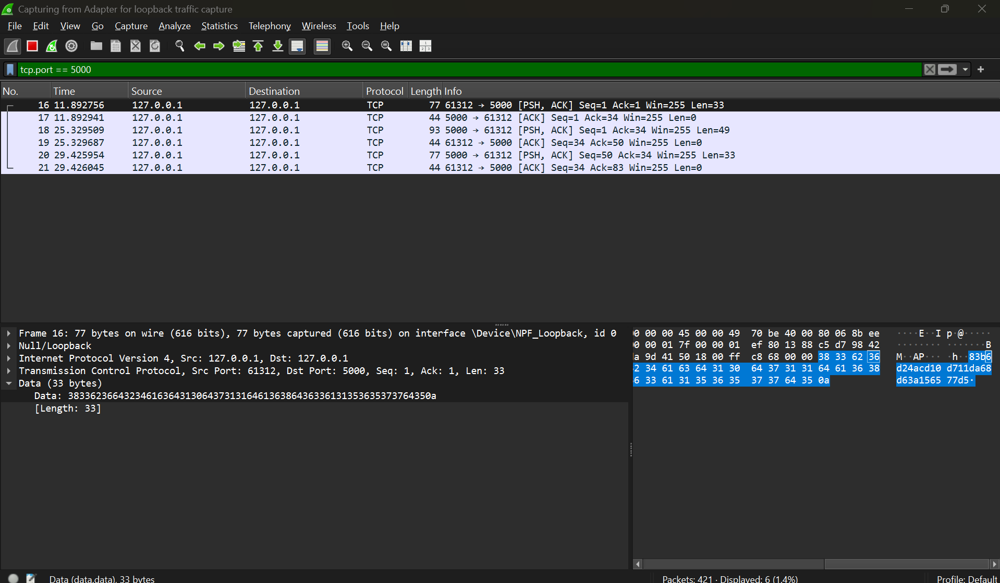

# Simulasi Komunikasi Dua Arah dengan Enkripsi DES

**Mata Kuliah:** Keamanan Informasi
**Nama:** Shifa Alya Dewi
**NRP:** 5025241176

---

## 1. Deskripsi

Program ini merupakan simulasi komunikasi dua arah antara sender dan receiver melalui jaringan TCP socket. Setiap pesan yang dipertukarkan 
dienkripsi menggunakan algoritma DES (Data Encryption Standard) sebelum dikirim, dan didekripsi setelah diterima.

## 2. Struktur Program

| File | Fungsi |
|------|--------|
| cipher.py | Modul implementasi algoritma DES, menyediakan fungsi encrypt dan decrypt |
| receiver.py | Program server. Membuka koneksi pada port 5000, menerima pesan, dan membalas |
| sender.py | Program client. Menghubungi receiver, mengirim pesan, dan menerima balasan |

## 3. Alur Komunikasi

1. Program receiver.py dijalankan lebih dahulu dan menunggu koneksi pada port 5000.
2. Program sender.py dijalankan dan melakukan koneksi ke receiver.
3. Kedua program telah memiliki key yang sama (keamanan) yang sudah disepakati
   sebelum komunikasi.
4. Pesan yang diketik dienkripsi menggunakan DES sehingga menghasilkan ciphertext.
5. Ciphertext dikirimkan melalui socket TCP ke pihak penerima.
6. Pihak penerima mendekripsi ciphertext menggunakan key yang sama sehingga
   diperoleh kembali plaintext.
7. Komunikasi berlangsung dua arah.

## 4. Algoritma DES

Implementasi DES pada cipher.py menggunakan parameter sebagai berikut:

- Ukuran blok: 64 bit (8 byte)
- Ukuran key: 64 bit (8 karakter)
- Jumlah ronde: 16 ronde Feistel
- Mode operasi: ECB (Electronic Codebook)
- Padding: PKCS#7

### 4.1 Proses Enkripsi

1. Plaintext diubah menjadi byte, kemudian ditambahkan padding sehingga
   panjangnya merupakan kelipatan 8 byte.
2. Key diproses melalui key schedule (PC-1, left shift, PC-2) untuk
   menghasilkan 16 subkey.
3. Setiap blok 64 bit diproses melalui tahapan berikut:
   - Initial Permutation (IP)
   - 16 ronde Feistel, dengan setiap ronde terdiri atas:
     - Expansion (E) pada bagian kanan
     - XOR dengan subkey
     - Substitusi melalui 8 S-Box
     - Permutasi (P)
     - XOR dengan bagian kiri
   - Pertukaran blok kiri dan kanan
   - Final Permutation (FP)
4. Hasil berupa ciphertext dalam bentuk byte.

### 4.2 Proses Dekripsi

Dekripsi menggunakan proses yang identik dengan enkripsi, namun urutan
subkey dibalik (dari subkey ke-16 hingga ke-1). Setelah dekripsi selesai,
padding dibuang untuk memperoleh plaintext asli.

## 5. Cara Menjalankan

Prasyarat: Python 3 terinstal. Tidak diperlukan instalasi library tambahan.

Buka dua terminal pada direktori yang sama.

Terminal 1 - menjalankan receiver:

    python3 receiver.py

Terminal 2 - menjalankan sender:

    python3 sender.py

Kedua program dapat saling mengirim pesan secara bergantian.
Program dihentikan dengan mengetik exit atau menekan Ctrl+C.

## 6. Contoh Output

Sender:

    > Halo, apakabar?
    cipher : ba9ef72449e19657da68d63a156577d5

Receiver:

     > cipher : ba9ef72449e19657da68d63a156577d5
       asli   : Halo, apakabar?

## 7. Dokumentasi

